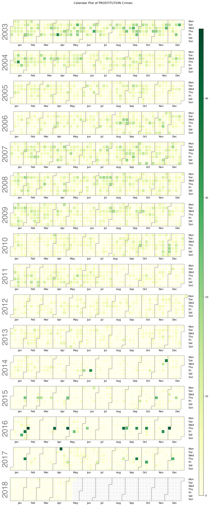

We will look into crimes in San Francisco during 2003 till mid 2018.
Our main crime is prostitution. It has some interesting patterns discoverd during the first few weeks in the class Social Data at DTU.

We start by looking at a calplot over the whole data period.

 
 The calplot depicting prostitution incidents from 2003 to 2018 reveals a fascinating trend. In the initial decade, there is a discernible decline in activity, as indicated by the progressively lighter shades of green each year, suggesting a potential reduction in prostitution crimes. However, the years that follow mark a notable shift. Beginning in 2014, there appears to be an extraordinary spike occurring once a month, with the intensity of the green much darker than even in 2009, which had the highest annual total for prostitution crimes within this data set.

This pattern may imply a strategic change in law enforcement approach, hinting that police operations or raids targeting these crimes might be concentrated into a single day each month, resulting in a significant number of charges being recorded on those specific dates. This shift in enforcement strategy could reflect a more focused or efficient allocation of police resources, potentially aiming for a greater impact by conducting comprehensive sweeps. It’s an intriguing development that warrants further investigation to understand the underlying causes of these enforcement patterns and their effectiveness in crime reduction strategies.
Prostitution from 2003 to 2018

To give us a feeling of the crime prone district we gather all crimes for the districts in San Francisco.
Below we have all crimes by distric. 
 <embed 
       type="text/html" 
       src="../assets/html/map.html"
       width="700"
       height="700"
       >
We can see that the souhern district has the most crimes.

Lets look at number of prostitution crimes by police districts. We can see that the Southern district is relatively low in prostitution.
<embed 
       type="text/html" 
       src="../assets/html/PROSTI_map.html"
       width="700"
       height="700"
       >

We can clearly see that Mission district dominates other districts by this terrible crime. Although Pie Charts do not get a good rep in the data science I think it shows well in this example how dominant the Mission district is.

<embed 
       type="text/html" 
       src="../assets/html/pie_chart_prostitution_crimes.html"
       width="700"
       height="700"
       >

<embed 
       type="text/html" 
       src="../assets/html/bar_chart_prostitution_crimes.html"
       width="700"
       height="700"
       >

Now why is the Mission district so distinct from the others? 
Well from my very limited research I could see that one of San Francisco finest brothel is located there. That could be a reason. Although I'm not totally sure how the poilce operates these types of crimes but I'm sure there is some correlation at least.

I't seems to be a middle income district by the numbers from  [this](https://statisticalatlas.com/place/California/San-Francisco/Household-Income) website. It's has a lot of immigrants who migrated from the Latino countries in the 1950's [(More on that here)](https://www.qualityoflife-themovie.com/website/mission.html) so maybe is prostitution more popular in the Lation community, something to look into.

